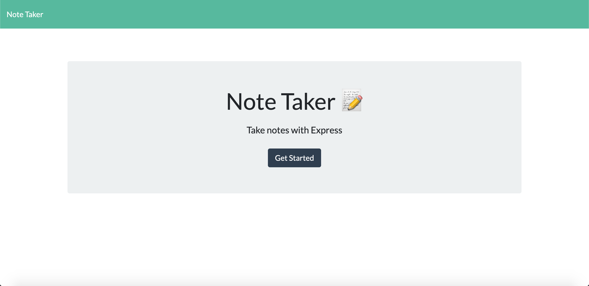
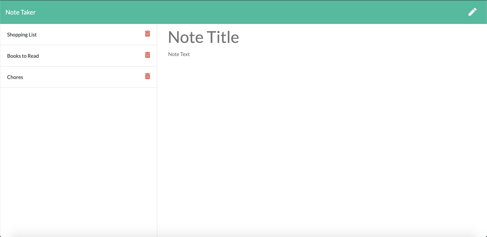

# Note Taker


## Description
This project allows the user to make notes and save them on a server using Express.js. The project is deployed on Heroku at the following link: https://anishasnet-note-taker.herokuapp.com/. 


## Table of Contents
* [Installation](#installation)
* [Usage](#usage)
* [Preview](#preview)
* [License](#license)
* [Contributing](#contributing)
* [Tests](#tests)
* [Questions](#questions)

## Installation

To install neccesary dependencies, run the following command:

```
npm install
```

## Usage

They should run the program using the following command: node server. It is locally hosted on port 3001.

## Preview
The first image is the welcome page for the note taking application. The second image shows the saved notes on the left and area to take new notes on the right.



## License

This project is under no license.

## Contributing

There are no special instructions for contributing.

## Tests

There are no tests for this program.

## Questions

For any further questions please email anishasnet@gmail.com. You can find more of my work at [anishasnet](https://github.com/anishasnet).
    